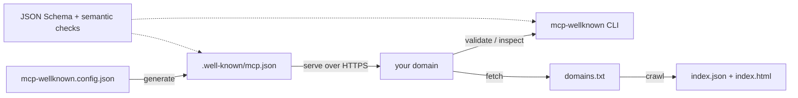

# mcp-wellknown

[English](README.md) | [中文](README.zh.md) | [日本語](README.ja.md)

[](LICENSE) 

**オープンソースで registry-free な MCP ケイパビリティディスカバリ。/.well-known/mcp.json の公開・検証・インデックス化を担います。**


```bash
# まだ npm に公開されていません — ソースからインストールします（クイックスタート参照）:
npm ci && npm run build && npm link
```

## なぜ mcp-wellknown なのか

エージェントはすでに MCP サーバーと会話できます。しかし、サーバーを「発見」する標準的な方法はまだありません。MCP サーバーを運用しているドメインでも、「何を公開しているのか、どのトランスポートで、どの認証方式なのか」に答える手段が存在しません。クローラにとっての `robots.txt`、OIDC クライアントにとっての `/.well-known/openid-configuration` が解決した問題と同じ構図です。mcp-wellknown はまさにその空白に対する動作するリファレンス提案です。`https://<your-domain>/.well-known/mcp.json` に JSON ドキュメントを公開し、その生成・検証・閲覧・インデックス化を行うツール一式が付属します。

公式の `.well-known` フォーマットはまだ存在しません。本プロジェクトは上流の MCP 仕様議論に資する具体的な提案であり、スキーマは議論の進展に追随します（1.0 までは破壊的なスキーマ変更をマイナーバージョンとしてリリースします）。公式 MCP Registry とは補完関係にあります。Registry は「どんなサーバーが存在するか？」に答え、`.well-known/mcp.json` は「*このドメイン*は何を自己宣言しているか？」に答えます。Registry や任意のクローラは well-known ドキュメントを収集でき、well-known ドキュメントは Registry のより豊富なメタデータを参照できます。

|  | mcp-wellknown | MCP Registry | Hand-maintained server lists |
|---|---|---|---|
| 登録手続き | None — publish one file on your domain | Required (publish to the registry) | Pull request to a list repo |
| 所有権の証明 | Domain control | Registry namespace rules | None |
| 鮮度 | Publisher-controlled (`updated_at` stamped on generate) | Publisher republish cycle | Manual edits |
| オフラインの検証 CLI | Yes (`validate`, exit code 0/1) | No | No |
| クロール可能なインデックス出力 | Yes (`index.json` + static `index.html`) | Central API | The list itself |

## 特徴

- **2 層の検証** — JSON Schema（Ajv、draft 2020-12）に加え、スキーマでは表現できないセマンティック検査を行います。HTTPS 限定のエンドポイント、サーバー名の一意性、semver の `version`、日付形式の `spec_version`、ISO 8601 の `updated_at`。すべての指摘に JSON Pointer パスと具体的な修正提案が付きます。
- **公開側のランタイムコストはゼロ** — `init` がフラグから設定を生成し、`generate` がビルド時に検証済みの静的ファイルを出力します。リクエスト時に動くコードはありません。
- **コマンド 1 つでインデックスサイト** — `crawl` がプレーンテキストのドメインリストから `index.json` と依存ゼロの静的 `index.html` を生成し、どこにでもホスティングできます。
- **オフライン前提の設計** — `inspect --file` と `crawl --offline` はネットワークなしで動作します。テストスイート全体もネットワークアクセスゼロで実行できます。
- **CI に適した終了コード** — 有効なら `0`、無効なら `1` で終了し、`--json` で機械可読の結果を出力するため、パイプラインに組み込めます。
- **型付きライブラリ API** — CLI の全機能を型付き関数としてエクスポートします（`validateDocument`、`generateDocument`、`crawlDomains` など）。生の JSON Schema もサブパスからエクスポートされます。

## クイックスタート

インストール:

```bash
# mcp-wellknown はまだ npm 未公開 — ソースからインストールします:
git clone https://github.com/JaydenCJ/mcp-wellknown
cd mcp-wellknown
npm ci && npm run build
npm link    # `mcp-wellknown` CLI を PATH に追加
```

ドメイン用のディスカバリドキュメントを生成して確認します:

```bash
mcp-wellknown init --name "Acme" --endpoint https://mcp.acme.dev/mcp \
  --capabilities tools,resources --contact mailto:mcp@acme.dev
mcp-wellknown generate
mcp-wellknown validate .well-known/mcp.json
```

出力:

```text
Wrote mcp-wellknown.config.json
Next: review it, then run "mcp-wellknown generate".
Wrote .well-known/mcp.json
Serve this file at https://<your-domain>/.well-known/mcp.json with content type application/json.
OK: document is valid
```

生成された `.well-known/mcp.json` をサイトルートに配置すれば、ドメインは発見可能になります。

## ドキュメント形式

`.well-known/mcp.json` の例（[`examples/mcp.json`](examples/mcp.json) 参照）:

```json
{
  "name": "Acme Developer Platform",
  "description": "MCP servers for Acme's public developer platform.",
  "version": "1.2.0",
  "spec_version": "2025-06-18",
  "contact": "mailto:mcp@acme.example",
  "updated_at": "2026-05-20T08:30:00+02:00",
  "servers": [
    {
      "name": "docs",
      "endpoint": "https://mcp.acme.example/docs",
      "transport": "streamable-http",
      "authentication": { "type": "none" },
      "capabilities": {
        "tools": ["search_docs", "fetch_page"],
        "resources": true
      },
      "docs": "https://developers.acme.example/mcp/docs"
    }
  ]
}
```

| フィールド | 必須 | 意味 |
| --- | --- | --- |
| `name` | はい | 公開者名（組織または製品）。 |
| `description` | いいえ | 公開サーバーの概要。 |
| `version` | いいえ | このドキュメントのバージョン（semver）。 |
| `spec_version` | はい | 対象とする MCP 仕様リビジョン。日付形式（例: `2025-06-18`）。 |
| `servers[]` | はい | MCP サーバーごとに 1 エントリ（最低 1 件）。 |
| `servers[].name` | はい | ドキュメント内で一意の識別子。 |
| `servers[].endpoint` | はい | MCP エンドポイントの HTTPS URL。 |
| `servers[].transport` | はい | `streamable-http` または `sse`。 |
| `servers[].authentication` | いいえ | `{ "type": "none" \| "oauth2" \| "bearer" }`。任意で `scopes`、`authorization_server`。 |
| `servers[].capabilities` | いいえ | サーバー側ケイパビリティ: `tools` / `resources` / `prompts` / `completions` / `logging`。それぞれ真偽値または名前のリスト。クライアント側ケイパビリティ（例: `sampling`）はここでは宣言しません。 |
| `servers[].docs` | いいえ | 人間向けドキュメントの URL。 |
| `contact` | いいえ | `mailto:` URI または `https://` URL。 |
| `updated_at` | いいえ | ISO 8601 タイムスタンプ。`generate` が自動で刻印します。欠落時は警告になります。 |

完全なスキーマは [`schemas/mcp-wellknown.schema.json`](schemas/mcp-wellknown.schema.json) にあります。

## CLI の使い方

### `validate` — ファイルまたは URL

```bash
mcp-wellknown validate .well-known/mcp.json
mcp-wellknown validate https://example.com/.well-known/mcp.json
mcp-wellknown validate --json .well-known/mcp.json
```

エラーはドキュメント内の位置を指し、修正方法を提示します:

```text
INVALID: 1 error(s), 0 warning(s)
  error  /servers/0/endpoint
         "endpoint" must use https://, got "http://"
         fix: Publish only TLS endpoints in discovery documents. Plaintext endpoints (including http://localhost) must not be advertised.
```

終了コードは有効なら `0`、無効なら `1` です。

### `inspect` — ドメインのケイパビリティ要約

```bash
mcp-wellknown inspect example.com
mcp-wellknown inspect --file examples/mcp.json
mcp-wellknown inspect --file examples/mcp.json --json
```

`--file` を付けない場合、`inspect <domain>` はネットワーク経由で `https://<domain>/.well-known/mcp.json` を取得します。

### `crawl` — インデックスサイトの構築

```bash
mcp-wellknown crawl examples/domains.txt --out site/
mcp-wellknown crawl examples/domains.txt --offline examples/offline --out site/
```

`site/index.json` は機械可読インデックス、`site/index.html` は依存ゼロの静的ページで、どこにでも（GitHub Pages、S3 など）ホスティングでき、MCP 対応ドメインの公開ディレクトリになります。`--offline <dir>` はネットワークの代わりに `<dir>/<domain>.json` を読みます。

### `init` / `generate` — 自分のドキュメントを公開

```bash
mcp-wellknown init --help
mcp-wellknown generate
mcp-wellknown generate --out-dir public/
```

`generate` は `mcp-wellknown.config.json` を読み込み、`updated_at` を刻印し、検証に失敗したドキュメントの書き込みを拒否します。

## ライブラリ API

```ts
import {
  validateDocument,
  generateDocument,
  crawlDomains,
  offlineLoader,
  schema,
  type McpWellKnownDocument,
} from "mcp-wellknown";

const result = validateDocument(JSON.parse(raw));
if (!result.valid) {
  for (const issue of result.errors) {
    console.error(`${issue.path}: ${issue.message}`);
    if (issue.suggestion) console.error(`  fix: ${issue.suggestion}`);
  }
}

const index = await crawlDomains(["example.com"], offlineLoader("./snapshots"));
```

CLI の全機能はプログラムからも利用できます。エクスポートされる型は `src/index.ts` を参照してください。生の JSON Schema はサブパスからも取得できます: `import schema from "mcp-wellknown/schema" with { type: "json" }`。

## 検証ルール

構造検証（JSON Schema）に加えて、以下のセマンティック検査を行います:

| 検査 | 重大度 | コード |
| --- | --- | --- |
| エンドポイントは解析可能な絶対 URL 必須 | error | `semantic/endpoint-url` |
| エンドポイントは `https://` 必須 | error | `semantic/endpoint-https` |
| サーバー名はドキュメント内で一意 | error | `semantic/server-name-unique` |
| `version` は semver | error | `semantic/version-semver` |
| `spec_version` は有効な `YYYY-MM-DD` リビジョン | error | `semantic/spec-version-format` |
| `spec_version` は実在するカレンダー日付 | error | `semantic/spec-version-date` |
| `updated_at` は ISO 8601 | error | `semantic/updated-at-iso8601` |
| `updated_at` の欠落／未来日時 | warning | `semantic/updated-at-*` |
| `docs` リンクは HTTPS 推奨 | warning | `semantic/docs-https` |
| `oauth2` は `authorization_server` を宣言すべき | warning | `semantic/oauth2-authorization-server` |
| `contact` は `mailto:` か `https://` を推奨 | warning | `semantic/contact-scheme` |

## アーキテクチャ



## ロードマップ

- [x] v0.1.0 — JSON Schema、2 層バリデータ、`init`/`generate`、`inspect`、オフライン対応の `crawl` と静的インデックス出力
- [ ] 上流の MCP ケイパビリティディスカバリ議論（SEP）に追随し、収束に合わせてスキーマ改訂をリリース
- [ ] 署名付きディスカバリドキュメントにより、クローラが完全性と出所を検証できるようにする
- [ ] `crawl` で定期的に再構築する MCP 対応ドメインの公開インデックスをホスティング
- [ ] クロールデータから月次の MCP 採用状況レポートを生成

全体は [open issues](https://github.com/JaydenCJ/mcp-wellknown/issues) を参照してください。

## コントリビューション

コントリビューションを歓迎します。特に上流の仕様議論が進行中の今、フィールド形式へのフィードバックは貴重です。まずは [good first issue](https://github.com/JaydenCJ/mcp-wellknown/issues?q=is%3Aissue+is%3Aopen+label%3A%22good+first+issue%22) から、または [Discussions](https://github.com/JaydenCJ/mcp-wellknown/discussions) でお気軽にどうぞ。開発環境のセットアップは [CONTRIBUTING.md](CONTRIBUTING.md) を参照してください。

## ライセンス

[MIT](LICENSE)
