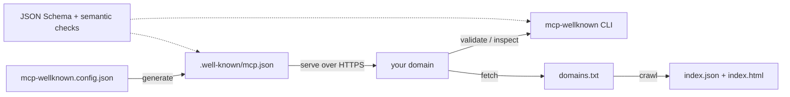

# mcp-wellknown

[English](README.md) | [中文](README.zh.md) | [日本語](README.ja.md)

[](LICENSE) 

**Open-source, registry-free capability discovery for MCP: publish, validate, and index /.well-known/mcp.json.**


```bash
# not yet published to npm — install from a source checkout (see Quickstart):
npm ci && npm run build && npm link
```

## Why mcp-wellknown?

Agents can already talk to MCP servers — but they still can't *find* them. A domain running MCP servers today has no standard way to answer "what do you expose, over which transport, with which auth?", the way `robots.txt` answers crawlers or `/.well-known/openid-configuration` answers OIDC clients. mcp-wellknown is a working reference proposal for exactly that gap: a JSON document at `https://<your-domain>/.well-known/mcp.json`, plus the tooling to generate, validate, inspect, and index it.

No official `.well-known` format has shipped yet; this project is a concrete proposal intended to inform the upstream MCP specification discussion, and the schema here will track it (breaking schema changes land as minor versions until 1.0). It complements the official MCP Registry: the Registry answers "what servers exist?", `.well-known/mcp.json` answers "what does *this domain* self-declare?" — a registry or any crawler can harvest well-known documents, and a well-known document can point at richer registry metadata.

|  | mcp-wellknown | MCP Registry | Hand-maintained server lists |
|---|---|---|---|
| Registration step | None — publish one file on your domain | Required (publish to the registry) | Pull request to a list repo |
| Ownership proof | Domain control | Registry namespace rules | None |
| Freshness | Publisher-controlled (`updated_at` stamped on generate) | Publisher republish cycle | Manual edits |
| Offline validator CLI | Yes (`validate`, exit code 0/1) | No | No |
| Crawlable index output | Yes (`index.json` + static `index.html`) | Central API | The list itself |

## Features

- **Two-layer validation** — JSON Schema (Ajv, draft 2020-12) plus semantic checks the schema can't express: HTTPS-only endpoints, unique server names, semver `version`, date-based `spec_version`, ISO 8601 `updated_at`. Every finding carries a JSON Pointer path and a concrete fix suggestion.
- **Zero runtime cost for publishers** — `init` scaffolds a config from flags, `generate` emits a validated static file at build time; nothing runs at request time.
- **One-command index site** — `crawl` turns a plain domain list into `index.json` plus a dependency-free static `index.html` you can host anywhere.
- **Offline by design** — `inspect --file` and `crawl --offline` work without any network; the entire test suite runs with zero network access.
- **CI-friendly exit codes** — valid exits `0`, invalid exits `1`, and `--json` gives machine-readable results for pipelines.
- **Typed library API** — everything the CLI does is exported as typed functions (`validateDocument`, `generateDocument`, `crawlDomains`, ...), and the raw JSON Schema ships as a subpath export.

## Quickstart

Install:

```bash
# mcp-wellknown is not on npm yet — install from a source checkout:
git clone https://github.com/JaydenCJ/mcp-wellknown
cd mcp-wellknown
npm ci && npm run build
npm link    # puts the `mcp-wellknown` CLI on your PATH
```

Scaffold, generate, and check a discovery document for your domain:

```bash
mcp-wellknown init --name "Acme" --endpoint https://mcp.acme.dev/mcp \
  --capabilities tools,resources --contact mailto:mcp@acme.dev
mcp-wellknown generate
mcp-wellknown validate .well-known/mcp.json
```

Output:

```text
Wrote mcp-wellknown.config.json
Next: review it, then run "mcp-wellknown generate".
Wrote .well-known/mcp.json
Serve this file at https://<your-domain>/.well-known/mcp.json with content type application/json.
OK: document is valid
```

Deploy the generated `.well-known/mcp.json` at your web root and your domain is discoverable.

## Document Format

A `.well-known/mcp.json` looks like this (see [`examples/mcp.json`](examples/mcp.json)):

```json
{
  "name": "Acme Developer Platform",
  "description": "MCP servers for Acme's public developer platform.",
  "version": "1.2.0",
  "spec_version": "2025-06-18",
  "contact": "mailto:mcp@acme.example",
  "updated_at": "2026-05-20T08:30:00+02:00",
  "servers": [
    {
      "name": "docs",
      "endpoint": "https://mcp.acme.example/docs",
      "transport": "streamable-http",
      "authentication": { "type": "none" },
      "capabilities": {
        "tools": ["search_docs", "fetch_page"],
        "resources": true
      },
      "docs": "https://developers.acme.example/mcp/docs"
    }
  ]
}
```

| Field | Required | Meaning |
| --- | --- | --- |
| `name` | yes | Publisher name (organization or product). |
| `description` | no | What the published servers offer. |
| `version` | no | Version of this document (semver). |
| `spec_version` | yes | MCP specification revision targeted, date-based (e.g. `2025-06-18`). |
| `servers[]` | yes | One entry per MCP server (min. 1). |
| `servers[].name` | yes | Unique identifier within the document. |
| `servers[].endpoint` | yes | HTTPS URL of the MCP endpoint. |
| `servers[].transport` | yes | `streamable-http` or `sse`. |
| `servers[].authentication` | no | `{ "type": "none" \| "oauth2" \| "bearer" }` plus optional `scopes`, `authorization_server`. |
| `servers[].capabilities` | no | Server-side capabilities: `tools` / `resources` / `prompts` / `completions` / `logging`, each a boolean or a list of names. Client capabilities (e.g. `sampling`) are not declared here. |
| `servers[].docs` | no | Human-readable documentation URL. |
| `contact` | no | `mailto:` URI or `https://` URL. |
| `updated_at` | no | ISO 8601 timestamp; `generate` stamps it automatically. Missing values raise a warning. |

The full schema lives at [`schemas/mcp-wellknown.schema.json`](schemas/mcp-wellknown.schema.json).

## CLI Usage

### `validate` — file or URL

```bash
mcp-wellknown validate .well-known/mcp.json
mcp-wellknown validate https://example.com/.well-known/mcp.json
mcp-wellknown validate --json .well-known/mcp.json
```

Errors point into the document and tell you how to fix them:

```text
INVALID: 1 error(s), 0 warning(s)
  error  /servers/0/endpoint
         "endpoint" must use https://, got "http://"
         fix: Publish only TLS endpoints in discovery documents. Plaintext endpoints (including http://localhost) must not be advertised.
```

Exit code is `0` for valid, `1` for invalid.

### `inspect` — capability summary for a domain

```bash
mcp-wellknown inspect example.com
mcp-wellknown inspect --file examples/mcp.json
mcp-wellknown inspect --file examples/mcp.json --json
```

Without `--file`, `inspect <domain>` fetches `https://<domain>/.well-known/mcp.json` over the network.

### `crawl` — build an index site

```bash
mcp-wellknown crawl examples/domains.txt --out site/
mcp-wellknown crawl examples/domains.txt --offline examples/offline --out site/
```

`site/index.json` is the machine-readable index; `site/index.html` is a dependency-free static page you can host anywhere (GitHub Pages, S3, ...) as a public directory of MCP-enabled domains. `--offline <dir>` reads `<dir>/<domain>.json` instead of the network.

### `init` / `generate` — publish your own

```bash
mcp-wellknown init --help
mcp-wellknown generate
mcp-wellknown generate --out-dir public/
```

`generate` reads `mcp-wellknown.config.json`, stamps `updated_at`, and refuses to write a document that fails validation.

## Library API

```ts
import {
  validateDocument,
  generateDocument,
  crawlDomains,
  offlineLoader,
  schema,
  type McpWellKnownDocument,
} from "mcp-wellknown";

const result = validateDocument(JSON.parse(raw));
if (!result.valid) {
  for (const issue of result.errors) {
    console.error(`${issue.path}: ${issue.message}`);
    if (issue.suggestion) console.error(`  fix: ${issue.suggestion}`);
  }
}

const index = await crawlDomains(["example.com"], offlineLoader("./snapshots"));
```

All CLI functionality is available programmatically; see the exported types in `src/index.ts`. The raw JSON Schema is also exposed as a subpath: `import schema from "mcp-wellknown/schema" with { type: "json" }`.

## Validation Rules

Structural (JSON Schema) plus these semantic checks:

| Check | Severity | Code |
| --- | --- | --- |
| Endpoints must be parseable absolute URLs | error | `semantic/endpoint-url` |
| Endpoints must be `https://` | error | `semantic/endpoint-https` |
| Server names unique within the document | error | `semantic/server-name-unique` |
| `version` is semver | error | `semantic/version-semver` |
| `spec_version` is a valid `YYYY-MM-DD` revision | error | `semantic/spec-version-format` |
| `spec_version` is a real calendar date | error | `semantic/spec-version-date` |
| `updated_at` is ISO 8601 | error | `semantic/updated-at-iso8601` |
| `updated_at` missing / in the future | warning | `semantic/updated-at-*` |
| `docs` links should be HTTPS | warning | `semantic/docs-https` |
| `oauth2` should declare `authorization_server` | warning | `semantic/oauth2-authorization-server` |
| `contact` should be `mailto:` or `https://` | warning | `semantic/contact-scheme` |

## Architecture



## Roadmap

- [x] v0.1.0 — JSON Schema, two-layer validator, `init`/`generate`, `inspect`, offline-capable `crawl` with static index output
- [ ] Track the upstream MCP capability-discovery discussion (SEP) and ship schema revisions as it converges
- [ ] Signed discovery documents, so crawlers can verify integrity and provenance
- [ ] Hosted public index of MCP-enabled domains, rebuilt from `crawl` on a schedule
- [ ] Monthly MCP adoption census report generated from crawl data

See the [open issues](https://github.com/JaydenCJ/mcp-wellknown/issues) for the full list.

## Contributing

Contributions are welcome — especially field-format feedback while the upstream specification discussion is active. Start with a [good first issue](https://github.com/JaydenCJ/mcp-wellknown/issues?q=is%3Aissue+is%3Aopen+label%3A%22good+first+issue%22) or open a [discussion](https://github.com/JaydenCJ/mcp-wellknown/discussions); development setup lives in [CONTRIBUTING.md](CONTRIBUTING.md).

## License

[MIT](LICENSE)
