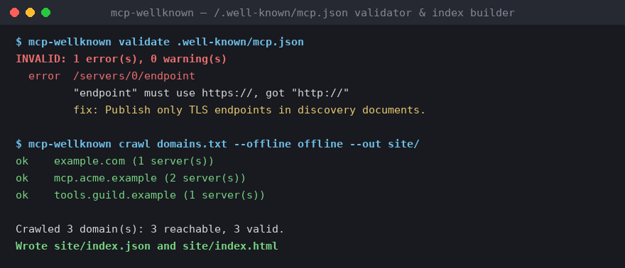
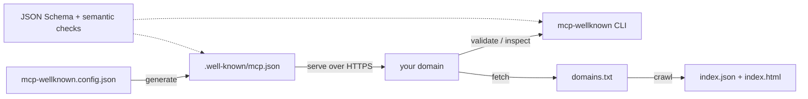

# mcp-wellknown

[English](README.md) | [中文](README.zh.md) | [日本語](README.ja.md)

[](LICENSE) 

**开源、registry-free 的 MCP 能力发现工具链：发布、校验并索引 /.well-known/mcp.json。**



```bash
# 尚未发布到 npm——请从源码检出安装（见快速开始）：
npm ci && npm run build && npm link
```

## 为什么是 mcp-wellknown？

Agent 已经能与 MCP server 对话——却仍然无法「发现」它们。今天一个运行着 MCP server 的域名，没有标准方式回答「你暴露了什么能力、走哪种传输、用哪种认证？」——而 `robots.txt` 之于爬虫、`/.well-known/openid-configuration` 之于 OIDC 客户端，早已解决了同类问题。mcp-wellknown 正是针对这一空白的可运行参考提案：在 `https://<your-domain>/.well-known/mcp.json` 发布一份 JSON 文档，并附带生成、校验、检视、索引它的全套工具。

官方 `.well-known` 格式尚未落地；本项目是一份具体提案，旨在为上游 MCP 规范讨论提供参照，此处的 schema 会跟进讨论演进（1.0 之前，破坏性 schema 变更以 minor 版本发布）。它与官方 MCP Registry 互补：Registry 回答「存在哪些 server？」，`.well-known/mcp.json` 回答「*这个域名*自声明了什么？」——Registry 或任何爬虫都可以收割 well-known 文档，well-known 文档也可以指向 Registry 中更丰富的元数据。

|  | mcp-wellknown | MCP Registry | Hand-maintained server lists |
|---|---|---|---|
| 注册步骤 | None — publish one file on your domain | Required (publish to the registry) | Pull request to a list repo |
| 所有权证明 | Domain control | Registry namespace rules | None |
| 新鲜度 | Publisher-controlled (`updated_at` stamped on generate) | Publisher republish cycle | Manual edits |
| 离线校验 CLI | Yes (`validate`, exit code 0/1) | No | No |
| 可爬取的索引输出 | Yes (`index.json` + static `index.html`) | Central API | The list itself |

## 特性

- **双层校验** —— JSON Schema（Ajv，draft 2020-12）+ schema 表达不了的语义检查：endpoint 强制 HTTPS、server 名称唯一、`version` 须为 semver、`spec_version` 须为日期格式、`updated_at` 须为 ISO 8601。每条问题都带 JSON Pointer 路径和具体修复建议。
- **发布方零运行时开销** —— `init` 由命令行 flag 生成配置，`generate` 在构建期输出经过校验的静态文件；请求时不运行任何代码。
- **一条命令生成索引站** —— `crawl` 把一份纯文本域名列表变成 `index.json` 和零依赖的静态 `index.html`，可托管在任意地方。
- **离线优先设计** —— `inspect --file` 与 `crawl --offline` 完全不需要网络；整个测试套件零网络访问即可运行。
- **对 CI 友好的退出码** —— 合法退出 `0`、非法退出 `1`，`--json` 输出机器可读结果，方便接入流水线。
- **带类型的库 API** —— CLI 的全部能力均以带类型的函数导出（`validateDocument`、`generateDocument`、`crawlDomains` 等），原始 JSON Schema 也通过子路径导出。

## 快速开始

安装：

```bash
# mcp-wellknown 尚未发布到 npm——从源码检出安装：
git clone https://github.com/JaydenCJ/mcp-wellknown
cd mcp-wellknown
npm ci && npm run build
npm link    # 将 `mcp-wellknown` CLI 加入 PATH
```

为你的域名生成并检查一份发现文档：

```bash
mcp-wellknown init --name "Acme" --endpoint https://mcp.acme.dev/mcp \
  --capabilities tools,resources --contact mailto:mcp@acme.dev
mcp-wellknown generate
mcp-wellknown validate .well-known/mcp.json
```

输出：

```text
Wrote mcp-wellknown.config.json
Next: review it, then run "mcp-wellknown generate".
Wrote .well-known/mcp.json
Serve this file at https://<your-domain>/.well-known/mcp.json with content type application/json.
OK: document is valid
```

把生成的 `.well-known/mcp.json` 部署到站点根目录，你的域名即可被发现。

## 文档格式

一份 `.well-known/mcp.json` 如下（参见 [`examples/mcp.json`](examples/mcp.json)）：

```json
{
  "name": "Acme Developer Platform",
  "description": "MCP servers for Acme's public developer platform.",
  "version": "1.2.0",
  "spec_version": "2025-06-18",
  "contact": "mailto:mcp@acme.example",
  "updated_at": "2026-05-20T08:30:00+02:00",
  "servers": [
    {
      "name": "docs",
      "endpoint": "https://mcp.acme.example/docs",
      "transport": "streamable-http",
      "authentication": { "type": "none" },
      "capabilities": {
        "tools": ["search_docs", "fetch_page"],
        "resources": true
      },
      "docs": "https://developers.acme.example/mcp/docs"
    }
  ]
}
```

| 字段 | 必填 | 含义 |
| --- | --- | --- |
| `name` | 是 | 发布方名称（组织或产品）。 |
| `description` | 否 | 所发布 server 的简介。 |
| `version` | 否 | 本文档的版本号（semver）。 |
| `spec_version` | 是 | 目标 MCP 规范修订版，日期格式（如 `2025-06-18`）。 |
| `servers[]` | 是 | 每个 MCP server 一条（至少 1 条）。 |
| `servers[].name` | 是 | 文档内唯一的标识符。 |
| `servers[].endpoint` | 是 | MCP endpoint 的 HTTPS URL。 |
| `servers[].transport` | 是 | `streamable-http` 或 `sse`。 |
| `servers[].authentication` | 否 | `{ "type": "none" \| "oauth2" \| "bearer" }`，可选 `scopes`、`authorization_server`。 |
| `servers[].capabilities` | 否 | 服务端能力：`tools` / `resources` / `prompts` / `completions` / `logging`，各为布尔值或名称列表。客户端能力（如 `sampling`）不在此声明。 |
| `servers[].docs` | 否 | 人类可读文档的 URL。 |
| `contact` | 否 | `mailto:` URI 或 `https://` URL。 |
| `updated_at` | 否 | ISO 8601 时间戳；`generate` 会自动盖章。缺失时给出警告。 |

完整 schema 见 [`schemas/mcp-wellknown.schema.json`](schemas/mcp-wellknown.schema.json)。

## CLI 用法

### `validate` —— 文件或 URL

```bash
mcp-wellknown validate .well-known/mcp.json
mcp-wellknown validate https://example.com/.well-known/mcp.json
mcp-wellknown validate --json .well-known/mcp.json
```

错误直接指向文档内部并告诉你如何修复：

```text
INVALID: 1 error(s), 0 warning(s)
  error  /servers/0/endpoint
         "endpoint" must use https://, got "http://"
         fix: Publish only TLS endpoints in discovery documents. Plaintext endpoints (including http://localhost) must not be advertised.
```

合法退出码为 `0`，非法为 `1`。

### `inspect` —— 域名能力摘要

```bash
mcp-wellknown inspect example.com
mcp-wellknown inspect --file examples/mcp.json
mcp-wellknown inspect --file examples/mcp.json --json
```

不带 `--file` 时，`inspect <domain>` 会通过网络拉取 `https://<domain>/.well-known/mcp.json`。

### `crawl` —— 生成索引站

```bash
mcp-wellknown crawl examples/domains.txt --out site/
mcp-wellknown crawl examples/domains.txt --offline examples/offline --out site/
```

`site/index.json` 是机器可读的索引；`site/index.html` 是零依赖静态页面，可托管在任意地方（GitHub Pages、S3 等），作为 MCP 域名的公开目录。`--offline <dir>` 读取 `<dir>/<domain>.json` 而不访问网络。

### `init` / `generate` —— 发布你自己的文档

```bash
mcp-wellknown init --help
mcp-wellknown generate
mcp-wellknown generate --out-dir public/
```

`generate` 读取 `mcp-wellknown.config.json`，自动盖 `updated_at` 时间戳，并拒绝写出未通过校验的文档。

## 库 API

```ts
import {
  validateDocument,
  generateDocument,
  crawlDomains,
  offlineLoader,
  schema,
  type McpWellKnownDocument,
} from "mcp-wellknown";

const result = validateDocument(JSON.parse(raw));
if (!result.valid) {
  for (const issue of result.errors) {
    console.error(`${issue.path}: ${issue.message}`);
    if (issue.suggestion) console.error(`  fix: ${issue.suggestion}`);
  }
}

const index = await crawlDomains(["example.com"], offlineLoader("./snapshots"));
```

CLI 的全部功能都可编程调用；导出类型见 `src/index.ts`。原始 JSON Schema 也可经子路径导入：`import schema from "mcp-wellknown/schema" with { type: "json" }`。

## 校验规则

结构校验（JSON Schema）之外的语义检查：

| 检查 | 级别 | 代码 |
| --- | --- | --- |
| endpoint 必须为可解析的绝对 URL | error | `semantic/endpoint-url` |
| endpoint 必须为 `https://` | error | `semantic/endpoint-https` |
| server 名称在文档内唯一 | error | `semantic/server-name-unique` |
| `version` 须为 semver | error | `semantic/version-semver` |
| `spec_version` 须为合法的 `YYYY-MM-DD` 修订版 | error | `semantic/spec-version-format` |
| `spec_version` 须为真实存在的日历日期 | error | `semantic/spec-version-date` |
| `updated_at` 须为 ISO 8601 | error | `semantic/updated-at-iso8601` |
| `updated_at` 缺失 / 位于未来 | warning | `semantic/updated-at-*` |
| `docs` 链接应为 HTTPS | warning | `semantic/docs-https` |
| `oauth2` 应声明 `authorization_server` | warning | `semantic/oauth2-authorization-server` |
| `contact` 应为 `mailto:` 或 `https://` | warning | `semantic/contact-scheme` |

## 架构



## 路线图

- [x] v0.1.0 —— JSON Schema、双层校验器、`init`/`generate`、`inspect`、支持离线的 `crawl` 与静态索引输出
- [ ] 跟进上游 MCP 能力发现讨论（SEP），随讨论收敛发布 schema 修订
- [ ] 签名的发现文档，让爬虫可以验证完整性与来源
- [ ] 托管一个公开的 MCP 域名索引站，用 `crawl` 定期重建
- [ ] 基于爬取数据生成月度 MCP 采用普查报告

完整列表见 [open issues](https://github.com/JaydenCJ/mcp-wellknown/issues)。

## 参与贡献

欢迎贡献——尤其是在上游规范讨论进行期间对字段格式的反馈。从 [good first issue](https://github.com/JaydenCJ/mcp-wellknown/issues?q=is%3Aissue+is%3Aopen+label%3A%22good+first+issue%22) 入手，或到 [Discussions](https://github.com/JaydenCJ/mcp-wellknown/discussions) 发起讨论；开发环境搭建见 [CONTRIBUTING.md](CONTRIBUTING.md)。

## 许可证

[MIT](LICENSE)
